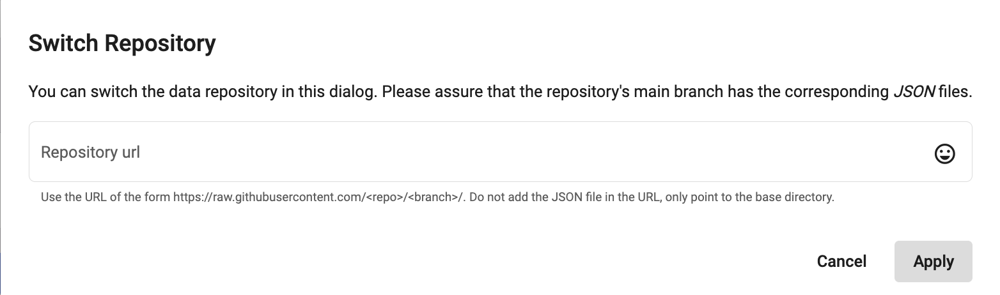
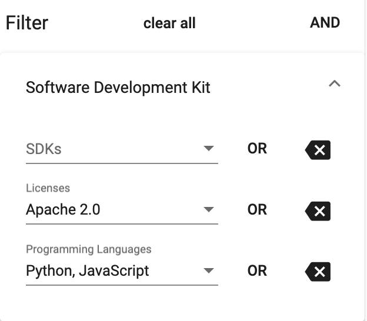
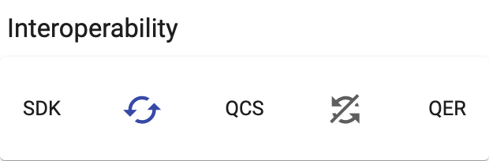

# Qverview
Qverview is a comparison framework for various technologies in the area of quantum application development.
It provides an overview of technologies, enables filtering, comparison and analysis of them, and allows identifying interoperabilities between different kinds of technologies.

Qverview itself is completely client-based and does not require a server, except for the data which Qverview should compare and display.

## Table of Contents
1. [Data](#data)
2. [Search and Filter](#search-and-filter)
3. [Interoperabilities](#interoperabilities)
4. [Demo](#demo)
5. [Disclaimer of Warranty](#disclaimer-of-warranty)
6. [Haftungsauschluss](#haftungsausschluss)

## Data
The data is located at a separate repository. Qverview allows to switch the repository if you wish to
view your own data.

### Format
The current technologies that Qverview allows to compare are the following ones:
* Software Development Kits
* Quantum Cloud Service
* Quantum Execution Resources
* (Quantum) Programming Languages
* Compilers & Transpilers
* Orchestrators

The data are represented in JSON formats. The formats must follow a certain scheme that are further described [here](data/schemas/README.md). We provide a certain
set of JSON Schema files which you can use in your IDE to validate your data.

### Configuring Your Default Repository
Qverview allows you to configure certain things, such as default repository and coloring (see later). The default repository is the first
repository that Qverview calls upon start. 

You can set the default repository to somewhere else by editing the [src/assets/config/config.json](src/assets/config/config.json) file. There
you can see the `defaultRepository` property which you can change accordingly.

Currently, the default repository is located at [http://github.com/kjuli/QverviewData](http://github.com/kjuli/QverviewData)

### Switching a Repository within the Same Session
If you wish to switch to another repository, then you can follow the following steps:

1. Click on `Switch Repository` which is in the top bar.
2. Enter the URL where your data repository is located following the rules stated below.
3. Click `OK` . Qverview now reloads and displays desired data.

### Repository Rules
In order for Qverview to find the respective data listed above, the link you provide should apply the following rules:

* **All JSON files must be located in the upper most directory**. Qverview simply uses your repository link and appends the file name
it wants to load. For instance, in order to load the Software Development Kits, Qveriew makes a GET request at `<your link>/SoftwareDevelopmentKits.json`.
**Note**: If you use a Github repository to host your data, use the url which allows you to see the raw content in Github. See
for example the [config](src/assets/config/config.json) file.
* **All your JSON files MUST follow the schema**. As already mentioned, the schema files are provided and further explained at [data/schemas](data/schemas)
* **The server of your data repository must allow GET requests to these files**. Check your server configurations that at least GET requests are granted to the
  files listed above. Currently, Qverview **does not write** data; hence, any other request types do not have to be supported for Qverview.

### Citations
Qverview allows you to add references and citations to your data in BibTeX format. The BibTex file should be located at `<repository-url>/references.bib`.

In order to cite, follow the instructions described [here](data/schemas/README.md).

If you do not have any citations, please create a `references.bib` file nonetheless, since Qverview will not work if for any of the
data it gets a 404 response.

### Data Cross-References
Each data object is named, i.e., there is a `name` property that should uniquely identify the object in that particular data set. It is possible
that another object of any data set might reference to it. I.e. SDKs can be supported on certain Quantum Cloud Services. In particular, Qiskit is
supported by IBMQ. Therefore, the SDK object identified by `"name": "Qiskit"` has a reference to the IBMQ object by specifying
`supportedQuantumCloudServices: ["IBMQ"]`.

These referencing is especially important to support interoperability (see later). When a data object, however, tries to reference
a non-existing object, then Qverview displays a `(undefined)` after the name.

### Coloring
Each item badge of the columns of each table can be colored, also configured in the [config](src/assets/config/config.json) file.

## Search and Filter
Qverview allows multi-criteria filtering of pre-mentioned data based on available attributes. Each table can be filtered in different columns.
Each filter rule can furthermore be connected via logical AND or OR gates. This allows for a more flexible filtering.

The search bar is a standard text field which searches all tables for the specific key, even if the table is filtered.

### Applying a Filter
On the left sidebar, there are panels for each table. In each panel, you can specify for each column the data points to filter in the drop-down menu. On the right side, there is
a toggle to switch between `AND` or `OR` (default). This connects the filtering of each data point within the column. I.e., when `Qiskit` and `XACC` are specified
for SDKs in the compiler/transpiler table, and the toggle is set to `OR`, then only those rows will be shown whose SDKs are `Qiskit`, `XACC` or both. Otherwise, only
those rows which supports both SDKs are shown.

The global `AND`/`OR` connector connects the columns. For example, in the sdk table, only those should be shown that are `Apache 2.0`-licenced AND supports `Javascript` or `Python`.

If nothing is specified in a drop-down menu, then for that column no filter is applied.

## Interoperabilities
Activate interoperability-feature between Software Development Kit (SDK), Quantum Cloud Service (QCS), and Quantum Execution Resource (QER) to show only interoperable technologies and hide incompatible ones.

To activate, click on the interoperability icons. Then, only those rows who have a reference or are referenced by the other table in some way are shown. Rows that do not reference a row of the other
table will be hidden.

# Download & Run
This project was generated with [Angular CLI](https://github.com/angular/angular-cli) version 10.2.0.
Run `ng serve` for a dev server. Navigate to `http://localhost:4200/`. The app will automatically reload if you change any of the source files.

# Disclaimer of Warranty
Unless required by applicable law or agreed to in writing, Licensor provides the Work (and each Contributor provides its Contributions) on an "AS IS" BASIS, WITHOUT WARRANTIES OR CONDITIONS OF ANY KIND, either express or implied, including, without limitation, any warranties or conditions of TITLE, NON-INFRINGEMENT, MERCHANTABILITY, or FITNESS FOR A PARTICULAR PURPOSE. You are solely responsible for determining the appropriateness of using or redistributing the Work and assume any risks associated with Your exercise of permissions under this License.

# Haftungsausschluss
Dies ist ein Forschungsprototyp. Die Haftung für entgangenen Gewinn, Produktionsausfall, Betriebsunterbrechung, entgangene Nutzungen, Verlust von Daten und Informationen, Finanzierungsaufwendungen sowie sonstige Vermögens- und Folgeschäden ist, außer in Fällen von grober Fahrlässigkeit, Vorsatz und Personenschäden, ausgeschlossen.
